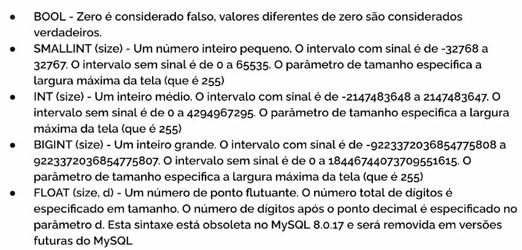
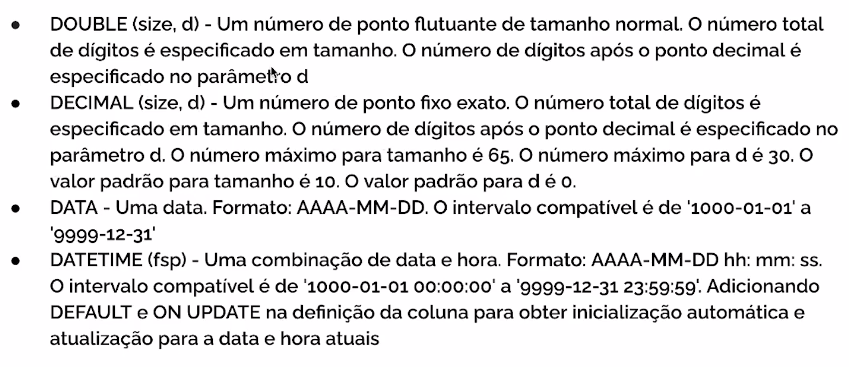
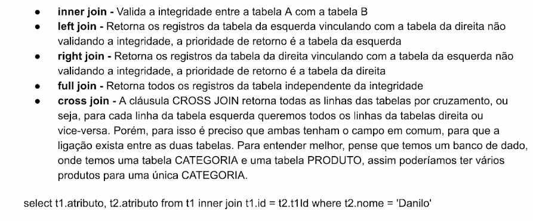

# Módulo - Banco de Dados SQL

## MySQL (e Linguagem SQL)
### É um banco e dados relacional.
- Tipos de dados:

    

    
    
    
    
- Normalização dos dados:
    - É um conjunto de regras que visa principalmente, a organização de um projeto de banco de dados para reduzir a redundância de dados, aumentar a integridade de dados e o desempenho.
    Para normalizar o banco de dados, deve-se examinar as colunas(atributos) de uma entidade e as relações entre entidades(tabelas), com o objetivo de se evitar anomalias observadas na inclusão, exclusão e alteração de registros.
- Inserção de dados:
    - Estrutura:
        - INSERT INTO [TABELA]([Atributos]) VALUES([Valores])
    - Exemplo:
        - INSERT INTO clientes(nome, telefone) VALUES('Lucas', '3422-0422');
- Atualização de dados:
    - Estrutura:
        - UPDATE [TABELA] SET [Atributos] = [Valores] WHERE [Atributo] = [Valor]
    - Exemplo:
        - UPDATET clientes SET nome = 'Lucas Guimarães' WHERE id = 1;
- Exclusão de dados:
    - Estrutura:
        - DELETE FROM [TABELA] WHERE [Atributo] = [Valor];
    - Exemplo:
        - DELETE FROM clientes WHERE id = 1;
- Seleção de dados:
    - Estrutura:
        - SELECT [Atributos] FROM [TABELA] WHERE [Atributo] = [Valor];
    - Exemplos:
        - SELECT * FROM clientes;
        - SELECT nome, idade FROM clientes WHERE id = 1;
        - SELECT * FROM clientes WHERE nome LIKE '%L';
        - SELECT * FROM clientes WHERE id IN (1,2,3,4);
        - SELECT * FROM clientes WHERE data_nascimento >= '2000-10-01' AND data_nascimento <= '2005-10-01';
        - SELECT * FROM clientes WHERE data_nascimento BETWEEN '2000-10-01' AND '2005-10-01';
- Junção de dados:
    - JOINs:
        
    - Exemplo:
        - SELECT pedidos.id, cliente.nome FROM pedidos INNER JOIN clientes ON cliente.id = pedido.cliente_id;
- Comando UNION:
    - Serve para juntar duas tabelas e trazer os dados de uma única vez.
    - Exemplo:
        - SELECT id, nome, telefone FROM clientes UNION SELECT id, nome, telefone FROM fornecedores;
- Paginando Dados:
    - Exemplo:
        - SELECT * FROM Orders LIMIT 10 OFFSET 10
- Agrupamento de dados:
    - SUM: Soma os dados e retorna um único valor.
        - Exemplo:
             - SELECT SUM(valor_total) FROM pedidos;
    - COUNT: Conta os dados e retorna um único valor.
        - Exemplo:
             - SELECT COUNT(id) FROM pedidos;
    - GROUP BY: Agrupa a soma ou a contagem de acordo com algum parametro.
        - Exemplo:
            - SELECT sum(valor_total) as total, cliente_id FROM pedidos GROUP BY cliente_id;
- Ordenação de Dados:
    - Estrutura:
        - SELECT * FROM [TABELA] ORDER BY [Atributo] [<ASC> OU <DESC>];
    - Exemplo:
        - SELECT * FROM clientes ORDER BY clientes.nome DESC;
        - SELECT * FROM clientes ORDER BY clientes.cpf ASC;
- Indexação de dados:
    - O índice serve para dar agilidade nas buscas com registros grandes, utilizamos indexação quando queremos definir um dado que será buscado e precisará retornar com uma maior facilidade em nosso banco de dados.
    - Estrutura:
        -  CREATE INDEX [index_name] ON [TABELA] (column1, column2, ...);
    - Cria índice onde os valores não podem ser duplicados:
        - CREATE UNIQUE INDEX [index_name] ON [TABELA] (column1, column2, ...);
- Criação de Tabelas por linha de comando:
    - Exemplo:
        - CREATE TABLE `nome_banco_dados`.`nome_tabela` (
            `id` INT NOT NULL AUTO_INCREMENT,
            `nome` VARCHAR(45) NOT NULL,
            `telefone` VARCHAR(12) NOT NULL,
            PRIMARY KEY(`id`),
            UNIQUE INDEX `id_UNIQUE` (`id` ASC) VISIBLE
        );
- Adicionando Colunas na Tabela:
    - Estrutura:
        - ALTER TABLE [TABELA] ADD COLUMN data_criacao DATETIME;
- Modificando Colunas na Tabela:
    - Estrutura:
        - ALTER TABLE [TABELA] CHANGE COLUMN data_criacao data_criacao VARCHAR(45);
- Criação de Views:
    - View é uma forma de pré formatar um select compilado.
    - Estrutura:
        - CREATE VIEW [nome_da_view] AS 
          SELECT [COLUNA1, COLUNA2, COLUNA 5]
          FROM [TABELA]
          WHERE COLUNA1 = 1;
    - Como usar:
        - SELECT * FROM [nome_da_view];

