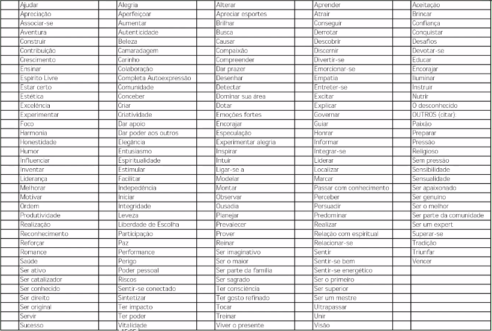
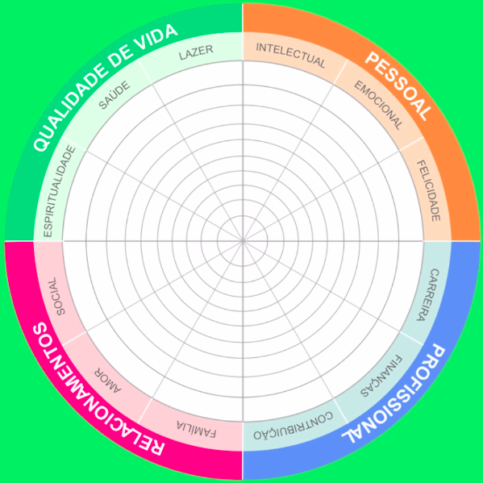
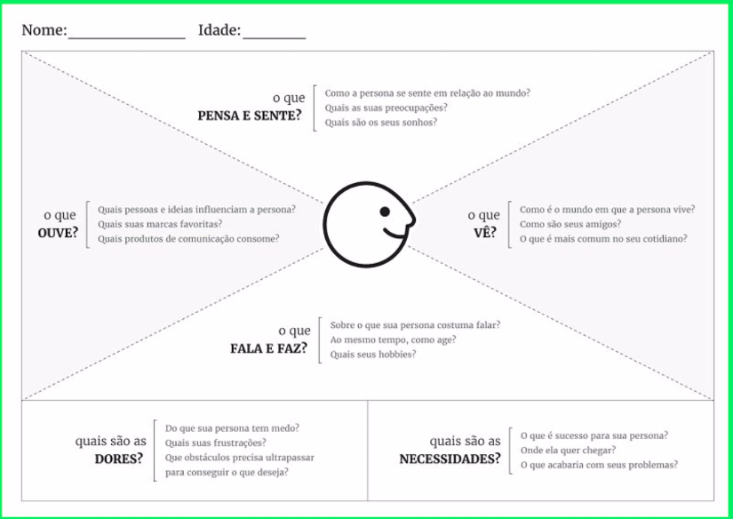
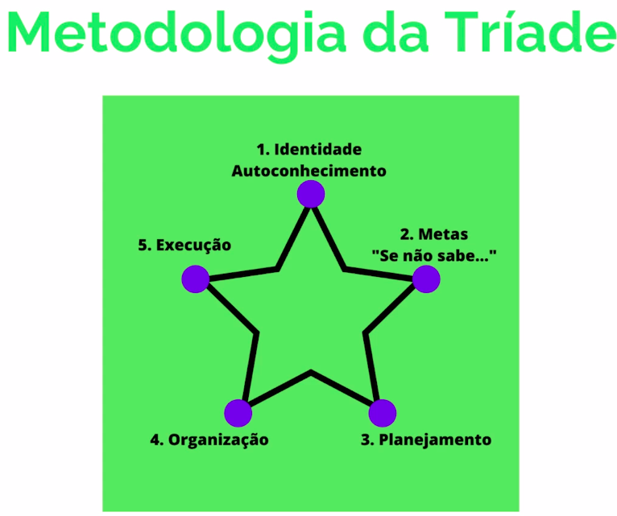
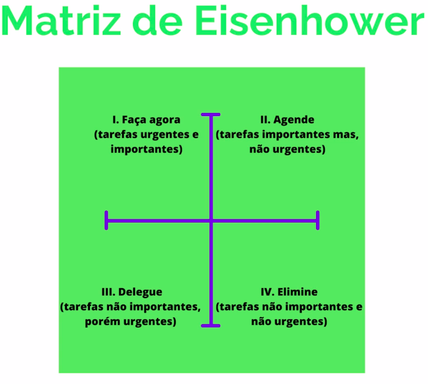

# Módulo - Desenvolvimento Pessoal

## Inteligência Emocional
### Por que a inteligência emocional é algo tão importante no nosso dia a dia.
- O que vai nos levar a uma trajetória de sucesso é a forma que nós interagimos com o mundo, um mundo que está em constante mudança e com um mar de informações passando a todo tmepo.
- Para lidar com o mundo hoje e com todas as informações que nos é apresentado precisamos saber lidar com as nossas emoções, ou seja, desenvolver o nosso QE (coeficiente de inteligência emocional).
### Como transformar a inteligência emocional em ações práticas contidianas?
- É necessário ter ciência de que é impossível ignorar nossas emoções e ser completamente racional.
- O ser humano emocionalmente inteligente consegue, perceber e gerenciar suas emoções.
- Para transformar a inteligência emocional em ações práticas precisa-se aplicar a autorresponsabilidade, ou seja, não terceirar a culpa das nossas falhas em controlar nossas emoções.
### Quais impactos me fazem praticar mais inteligência emocional?
- <b>1º Pilar - Autoreconhecimento:</b>
    - Saber o que te causa um sentimento e o que você faz quando está sentindo esse sentimento.
    - Conhecer os seus <b>valores</b> é um grande passo para um autoconhecimento, escolha abaixo 20 items da tabela de valores dos quais você não abre mão em uma relação.
    
    - Dos 20 escolhidos, escolham o top 5 dessa lista, que são indispensáveis para você no seu dia a dia.
    

    - Agora, voltado para a área que a nota foi a menor, ou seja, a mais insatisfeita, pense em 3 ações de curto prazo que você pode praticar para melhorar essa área e anote-as.
     <b>OBS: Essas açõe- <b>2º Pilar - Autogestão:</b>
    - O pilar da autogestão remete a adaptabilidade, gerenciamento para conquista e paranoma positivo.
    - Com base nos seus valores utilize a roda da vida abaixo pontue de 0 a 10 como esta satisfeito com uma das 12 áreas principais da sua vida.s precisam estar atreladas a objetivos mensuráveis, para que seja nítido se você estão as comprindo ou não.</b>
- <b>3º Pilar - Conhecimento Social:</b>
    - Não confunda empatia com simpatia.
    - Use abaixo o mapa da empatia, para tentar entender racionalmente como é estar no lugar de determinada pessoa ou persona de cliente.
    

    - Trate o outro como o outro gostaria de ser tratado, pois ele tem valores diferentes dos seus.
- <b>4º Pilar - Gestão de Relacionamento:</b>
    - Sempre separe um dia/horário que você dará atenção para ajudar os outros no seu time ou ao seu redor, como por exemplo:
        - Dar feedbacks e aumentar a confiança do seu time.
        - Compartilhar algum conhecimento.
    - Pessoas emocionalmente inteligentes não olham só para si, olham para si e para os demais.

## Escuta Ativa
- Nossas comunicações são cheias de ruídos, potanto ter uma boa comunicação é um grande diferencial.
- 55% da nossa comunicação é absorvida pelas outras pessoas através da <b>linguagem corporal</b>.
- 38% dessa comunicação é absorvida pela outra pessoa através do <b>tom de voz</b>.
- 7% da nossa comunicação é absorvida pela outra pessoa através <b>do que é falado</b>.
- Se conectar com as pessoas enquanto está falando é essencial, e para desenvolver essa capacidade primeiro é necessário escutar bem e através da escuta entender quais são as emoções dessas pessoas.
    - <b>Ouvir</b> compreendo também a <b>capacidade de captarmos</b> o que os outros querem dizer e <b> escutar suas emoções</b> por meio de palavras.
- Para escutar bem é necessário <b>estar presente</b> duarante o exercício de escutar. E não ficar pensando outras coisas.
- Não escute para responder, <b>escute para entender</b>.
- <b>5 técnicas de escuta ativa:</b>
    
    - <b> 1ª Silêncio:</b> Após fazer uma proposta ou uma apresentação, não fale mais nada, dê 3 segundos para a pessoa fazer a sua reflexão e responder.
    
    - <b> 2ª Espelhar o comportamento:</b> Repetir alguns gestos ou palavras que a pessoa faz/fala para transmitir a ela que é uma conversa segura e de igual para igual.

    - <b> 3ª Constatação:</b> Entender e constar de fato o problema para que você possa ajudá-lo amplamente.

    - <b> 4ª Sumarização:</b> Resumir o que a pessoa disse e confirmar com ela se é aquilo mesmo que você entendeu.

    - <b> 5ª Rotulação:</b> Quando a pessoa estiver insegura por exemplo, você rotula ela, "você está insegura? tem algo que eu posso fazer?" e a pessoa vai sentir a necessidade de justificar porquê ela está insegura ou não e isso vai te possibilitar entender e se conectar melhor com aquela pessoa.

## Gestão de Tempo
### Principais passos para uma boa gestão do tempo
- Planejamento
- Metas/objetivos
- Prazos
- Dizer não
- Priorização de tarefas
- Gastar o tempo certo na atividade certa

### Alguns Teóricos
#### <b>Peter Drucker</b> fala sobre gestão de si mesmo e coloca o tempo como o bem mais valioso que temos e isso é a chave para que possamos ter em mente que é sim possível realizar todas as nossas funções/atividades.
- "O tempo é o recurso mais escasso e, a menos que seja gerenciado, nada mais pode ser gerenciado."
- "Tempo é dinheiro"
- O que é a <b>Gestão do Tempo?</b> É um conjunto de ações articuladas para obter melhor desempenho através da organização das atividades do nosso tempo. Tornando o trabalho mais dinâmico e ágil.
#### <b>Christian Barbosa</b> propõe a ideia de Tríade, o tempo se divide em três esferas, importante, urgente e circunstancial.
- <b>Importante (70%): </b> Atividades que tem importância na sua vida, trazem resultado a curto médio ou longo prazo.
- <b>Urgente (20%): </b> Atividades onde o tempo está curto ou acabou, pode causar problemas de saúde e afastar pessoas importantes.
- <b>Circunstancial (10%): </b> Tarefas desnecessárias, feitas por comodidade ou por serem socialmente apropriadas.

- A produtividade pode ser mensurada de forma quantitativa e qualitativa.
    - Quantitativa:
        - O que é importante fazer no meu dia?
        - Quantas tarefas executo?
        - Quanto tempo levo para cada tarefa?
        - E com a pandemia, melhorou, piorou?
    - Qualitativa:
        - Percepção de que aproveita mais, curte mais seus relacionamentos, aproveitando mais lazer, habbies e amigos.

#### <b>Stephen Covey</b> autor do livro <b> "Os sete hábitos das pessoas altamente eficazes"</b>.

#### <b>Dwight Eisenhower</b> ex-presidente dos EUA, com a <b>Matriz de Eisenhower</b>.
- Abaixo é exemplificado a matriz, que serve como uma forma de priorizar tarefas.

### Ferramentas Úteis
- Any.do (tarefas e calendário).
- To Do List (lembretes e planejamento).
- Mindlist (lista de tarefas).
- To Do (organização e utilidades).
- Pomodoro (organizador ded tarefas pessoas e equipe).
- Trello (organizador de tarefas pessoal e equipe).
- Kanban (fazer, fazendo e feito).

### Referências e Sugestões

## Produtividade (dicas para um dia a dia mais produtivo)
- Livros:
    - A tríade do tempo - Christian Barbosa
    - Essencialismo - Greg Mckeown
    - Os sete hábitos das pessoas altamente eficazes - Stephen Covey
    - The Myth of Multitasking - Dave Crenshaw