# Módulo - Cultura DevOps

## O que é DevOps?
- DevOps é uma <b>abordagem de cultura, automação e design</b> de plataforma que tem como objetivo agregar mais valor aos negócios e <b>aumentar sua capacidade de resposta ầs mudanças por meio de entregas de serviços rápidas de alta qualidade</b>. Tudo isso é possível por meio da disponibilização de serviços de TI rápidos e <b>iterativos</b>. Adotar o DevOps significa conectar aplicações legadas a <b>uma infraestrutura e aplicações modernas e nativas em nuvem</b>.
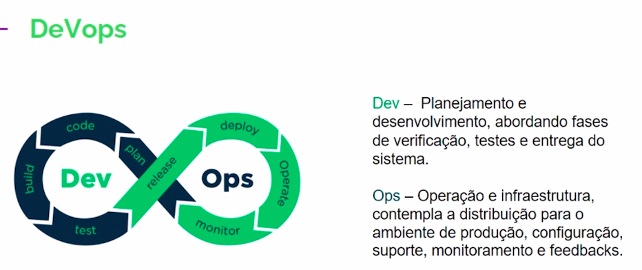

- O que não é DevOps?
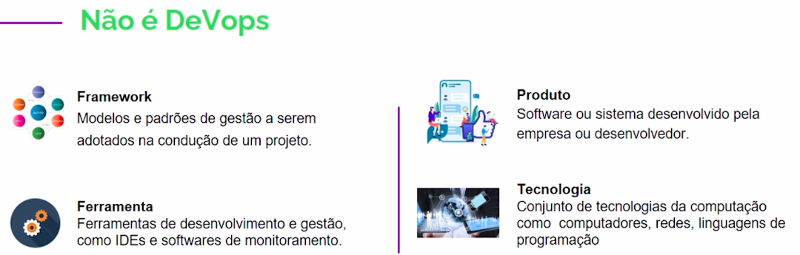

## Porque devo adotar a cultura DevOps?

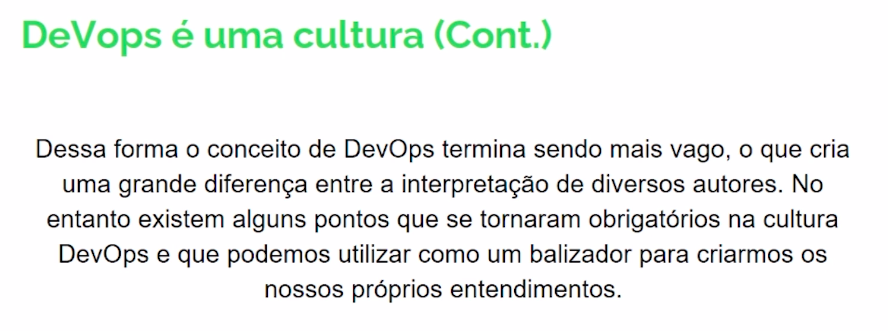

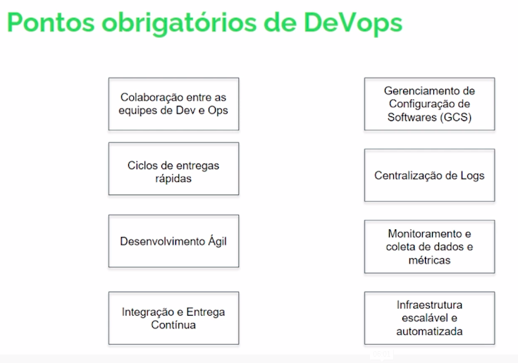

## História do DevOps:

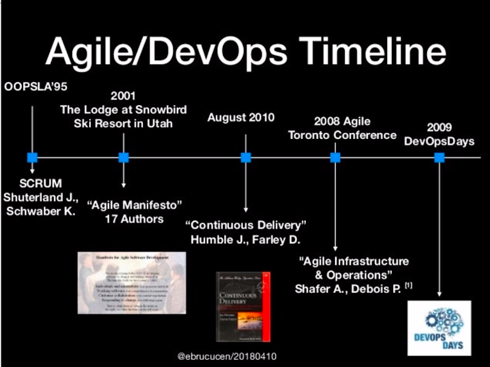

## Ambientes de DEV e OPS:

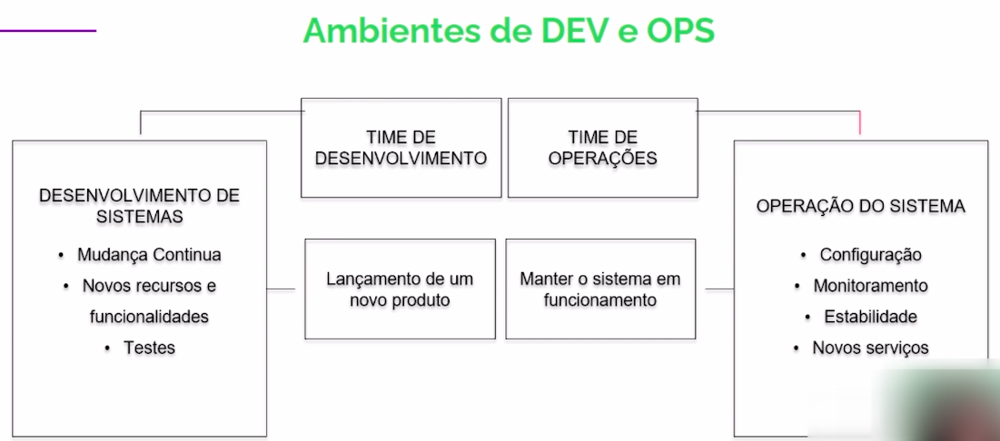

## Conceito de DevOps:
- <b>DevOps</b> tem haver com <b>pessoas</b> e sua capacidade de se relacionarem e trocarem experiências. Dessa forma não podemos restringir essa cultura apenas às equipes de DEV e OPS mas estende-las a toda organização, uma vez que o foco deve ser o negócio e não a tecnologia. Essa mudança deve vir das <b>pessoas</b>, e seguir uma ideia de quebrar barreiras.

<b>O ambeinte corporativo deve dar liberdade para que todos expressem suas ideias e compartilhem experiências, independente do nível hierárquico ou área de atuação.</b>

Um bom teste para isso é ver se um estagiário se sente a vontade de propor novas ideias ao gerente ou mesmo a um diretor.

## CAMS
- O que é?
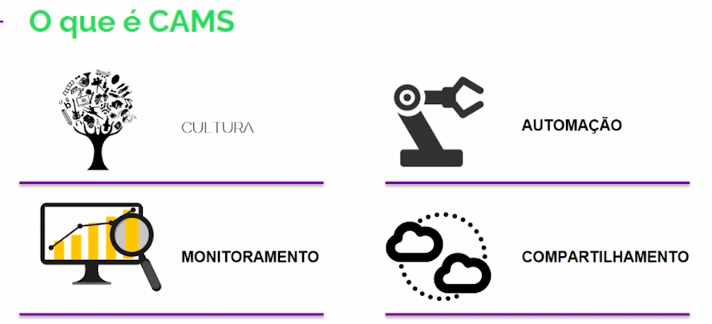
- Cultura:
    - Destrua os silos.
    - A interação entre as equipes é fundamental para o DevOps.
    - Esteja aberto a novas opções.
    - Pare de culpar.
    - Comunique-se com todos, independente da hierarquia.
    - Envolva toda a equipe nos processos e decisões.
    - Sempre pergunte.
    - Nunca diga nunca.
    - Faça Stand-Ups diários.
- Automação:
    - É o ponto mais atrativo do DevOps para os gestores, pois trrás um ganho de produtividade. Mas essa não é a razão para o uso da Automação no DevOps e sim:
        - Evitar defeitos.
        - Criar consistência no software e no ambiente de operação.
        - Melhoria de qualidade.
        - Optimização de tarefas repetitivas.
    - São exemplos de automações no DevOps o uso de controle de versões, automação de testtets e infraestrutura como código.
    - O que podemos automatizar:
        - Builds;
        - Implementações;
        - Testes:
            - Qualidade de código;
            - Funcional;
            - Integração;
        - Optimização de tarefas repetitivas;
        - Deploy;
        - Release;
        - Monitoramento;
- Monitoramento:
    - Para um processo de gestão e monitoramento de processos e atividades podemos partir de um pressuposto:
        - Se você não consegue medir, não saberá "como" ou "o que" melhorar!
    - Obtenda métricas de:
        - Procesos;
        - Desempenho;
        - Pessoas;
    - Esses dados devem ser significativos e ter um fim especifico, além do processo de obtenção dos dados dever ser transparente e acessível por todos na organização.
- Compartilhamento:
    - Sempre compartilhe ideias e problemas! Alguém já pode ter passado pela mesma situação e pode ter a resposta que você precisa.

## PPT (Pessoas, projetos e tecnologias)
- Pessoas
    - As pessoas que fazem parte de uma organização com a cultura de DevOps devem sempre estar atentas às novas tecnologias, e são raros os momentos onde contratar um novo funcionário para atender uma demanda especifica será vantajoso.
    - Ciclos contínuos de capacitação devem ocorrer, mantendo as equipes sempre atualizadas sobre as novas tecnologias.
    - As pessoas devem cooperar e colaborar para atingir os objtivos da corporação.
- Projetos/Processos:
    - Com a mudança na cultura da organização os processos também sofrerão mudanças;
    - Os processos devem ser alterados para que o Desenvolvimento e Operação colaborem durante o desenvolvimento;
        - Em alguns casos os temas de segurança também devem ser envolidos nos processos visando otimizar o desenvolimento e reduzir as brachas de segurança. Nesse caso podemos chamar de <b>DevSecOps</b>.

    - Automatizar a maior parte possível dos processos, desde a sua concepção;
    - Remover restrições;
    - Criar fluxos de entrega;
    - Loops de feedback devem estar presentes em todas as fases.
- Tecnologias/Ferramentas no DevOps
    - As ferramentas, ou tecnologias, nos ajudarão em todo o processo de adoção do DevOps. Sendo que diferentes ferramentas auxiliarão em diferentes processos.
    - As ferramentas podem nos auxiliar nos processos de:
        - Colaboração.
        - Desenvolvimento.
        - Controle de qualidade.
        - Deploy.
    - Devemos estar atentos ao fato de que não existem ferramentas de DevOps, o que as fazem especiais, nesse ambiente, é a forma como as utilizamos.
    
    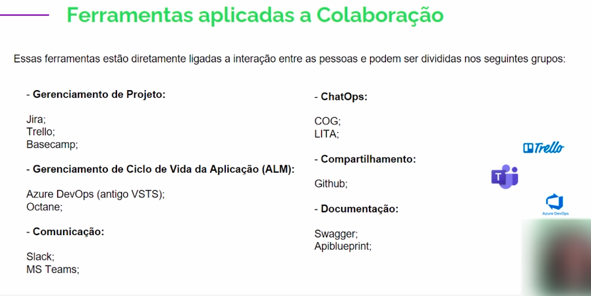

    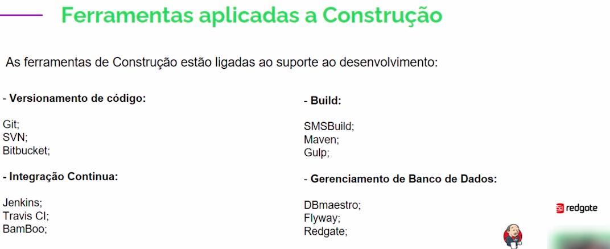

    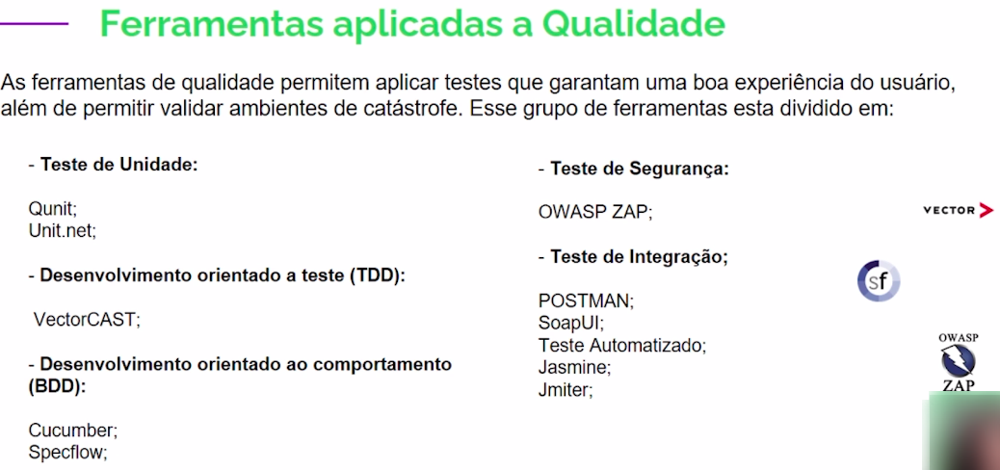

    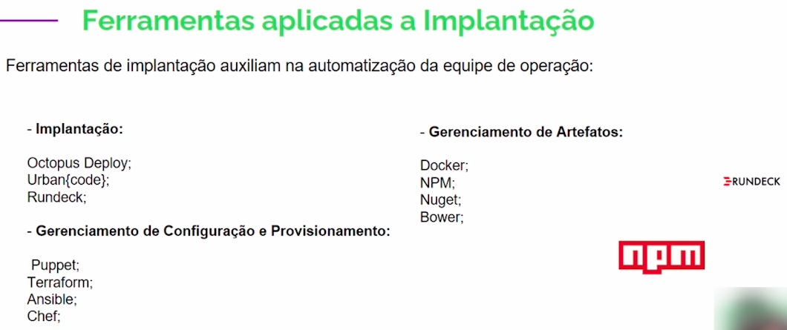

    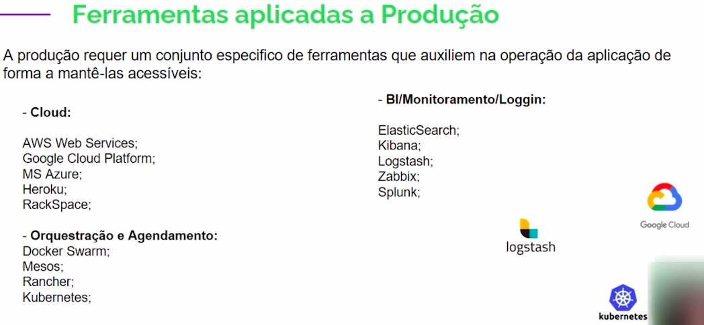

## Desenvolimento Ágil e DevOps
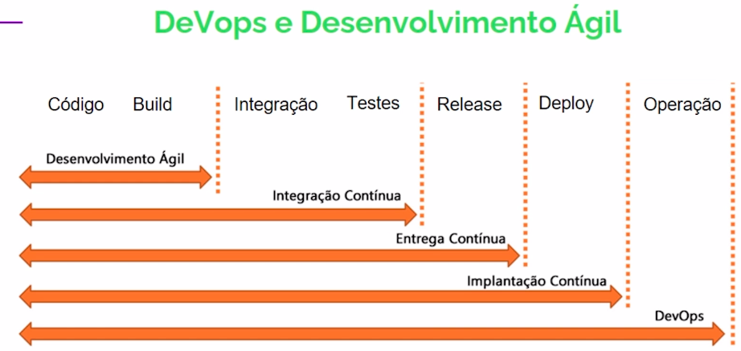

## CI/CD
- O ciclo de desenvolvimento DevOps pode ser dividido em 5 fases continuas, sendo elas <b>Desenvolvimento, Teste, Integração, Deploy e Monitoramento.</b> Essas fases são comumente agrupadas em: <b>Integração continua</b> e <b>Entrega Continua</b> (<b>CI</b> e <b>CD</b>).
