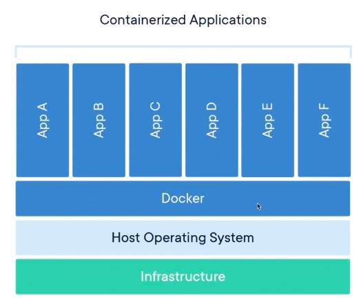
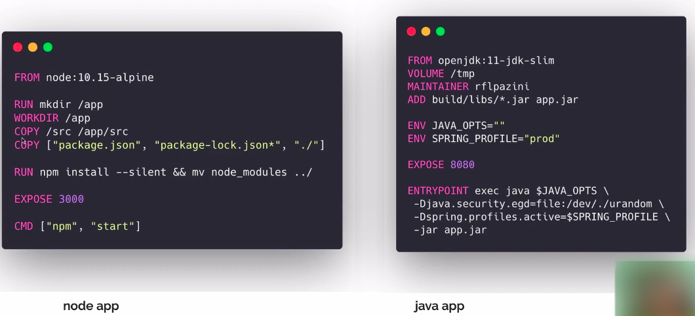
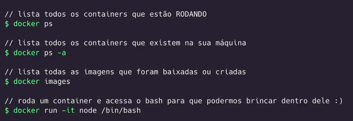
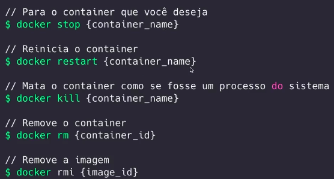
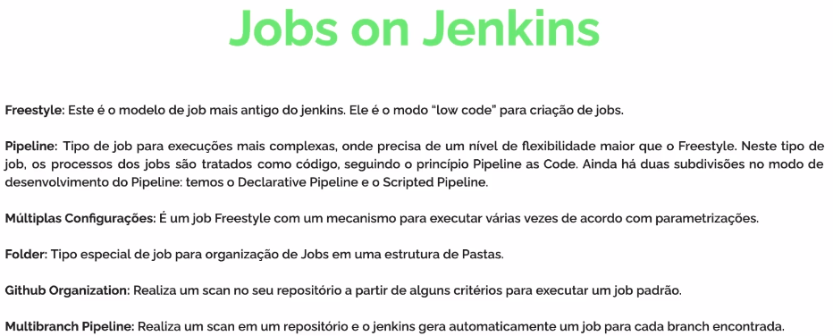

# Módulo - Jenkins e Docker

## Objetivos:
- Entender containers.
- Configurar imagens.
- Entender uma pipeline de build.
- Configurar os steps da pipeline.
- Empacotar uma aplicação e fazer o deploy de uma forma automática.

## Docker
### Containers

- Containers são uma abstração na camada da aplicação que empacota código e suas dependências juntas para que o aplicativo seja executado de forma rápida e confiável de um ambiente de computação para outro.

- Estrutura:

- Vantagens:
    - Praticidade / simplicidade.
    - Tamanho.
    - Empacotamento.
    - Compartilhamento.

- Dockerfile
    - É o modo que utilizamos para criar nossas próprias imagens. Ele ser como uma receita para construir um container, permitindo definir um ambiente personalizado e próprio para qualquer projeto.
    - Exemplos:
    

- Imagens
    - São compostas por sistemas de arquivos de camadas que ficam uma sobre as outras. Ela é a nossa base para construção de uma aplicação.
    - Todas imagens: https://hub.docker.com

- Comandos básicos do Docker:
    
    

    

    ## Jenkins
    - Junkins é um servidor de automação de código aberto. Ele gerencia e controla os processos de entrega de software em todo o ciclo de vida, incluindo construção, documento, teste, pacote, estágio, implantação, análise de cóidigo estático e muito mais.

    ### Jobs on Jenkins
    
    