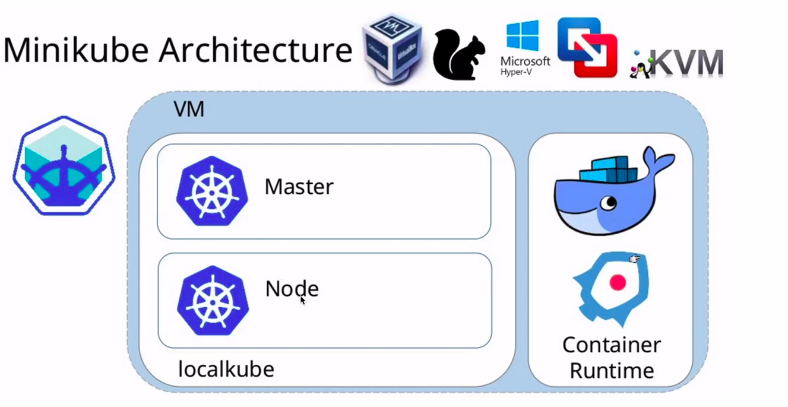
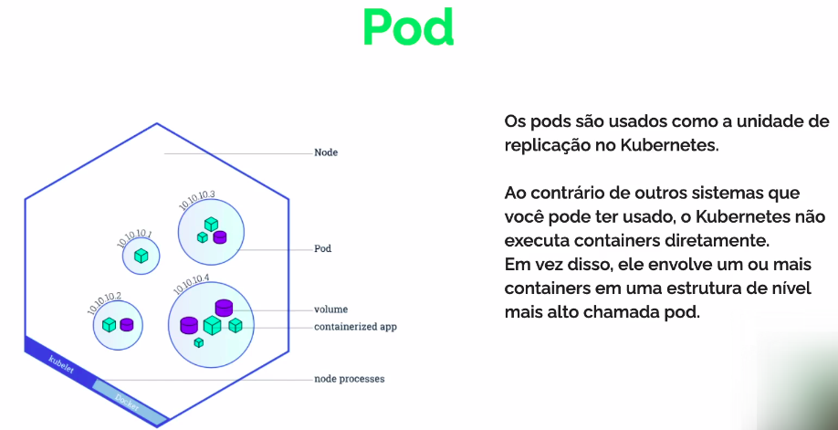
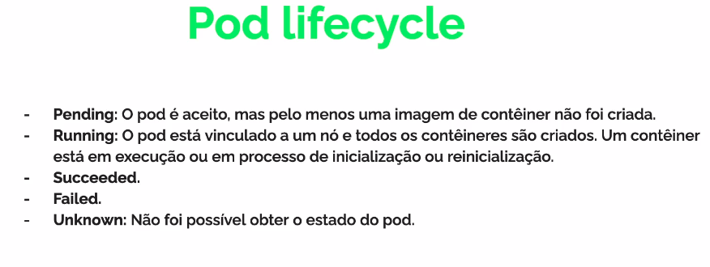
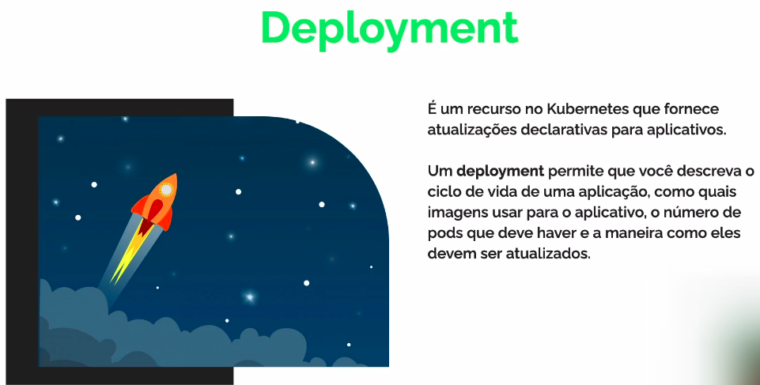
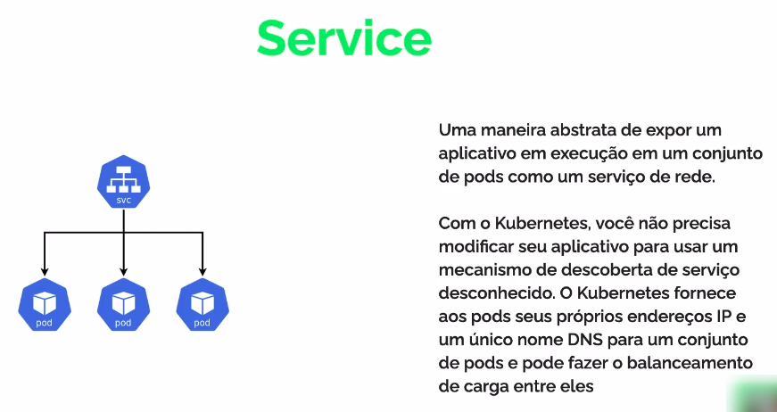
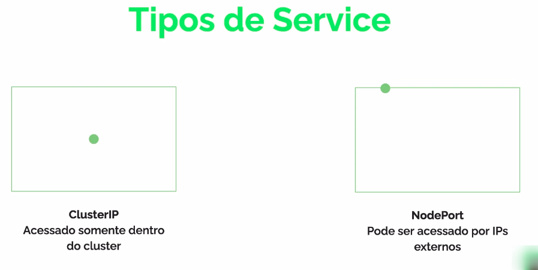
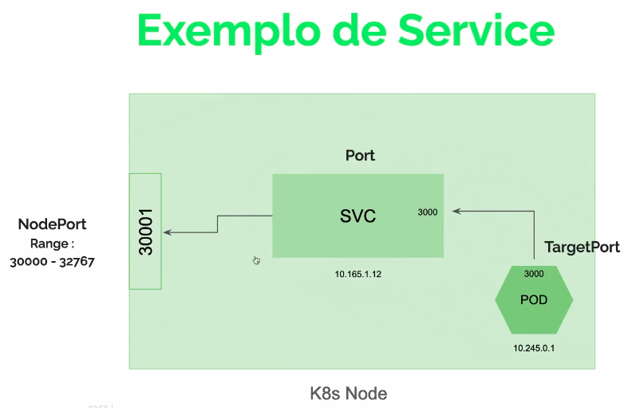

# Módulo - Kubernets

## K8s e suas possibilidades:
- Orquestrar containers em vários hosts.
- Aproveitar melhor o hardware para maximizar os recursos necessários na execução das aplicações.(Cluster)
- Controlar e automatizar as implantações e atualizações de aplicações.
- Escalar rapidamente as aplicações em containers e recursos relacionados.
- Verificar a integridade e autorecuperação das aplicações com posicionamento, reinício, replicação e escalonamento automáticos.

## Cluster
- É um conjunto de máquinas para a execução de aplicativos em contêiners...
- Se você estiver executando o K8s, estará executando um cluster.
- Um cluster Kubernetes consiste em dois tipos de recursos:
    - O Control Plane coordena o cluster.
    - Node são os trabalhadores que executam aplicativos.

## Rodando Local
### minikube
- É o Kubernets local, com foco em facilitar o aprendizado e o desenvolvimento para o Kubernetes.

## Pod

## Deployment

## Service

## Variáveis de ambiente
- Uma variável de ambiente é um valor nomeado que pode afetar o modo como os processos em execução irão se comportar em um computador.

