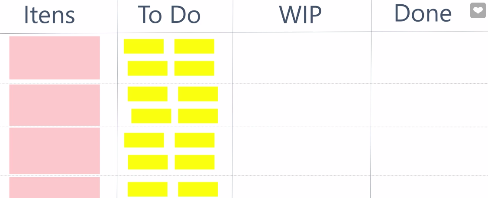

# Kanban
- O objetivo do Kanban é atender demandas que estão chegando da forma mais eficiente possível.
- O foco do Kanban é simplesmente em eliminar desperdício.
- 3 conceitos chave do Kaban:
    - Visualizar o fluxo de trabalho (workflow).
    - Limitar o trabalho em progresso (TEP) (Work in Progress; WIP).
        - Isso é para evitar probemas como gargálos ou burnout.
    - Mensurar o tempo de espera (lead time).
        - Geralmente é utilizado um gráfico chamado <b>Cumulative Flow</b> para tentar identificar onde estão os gargálos.
- As demandas são spearadas em pelo menos 3 colunas, sendo estas, <b>To Do</b>, <b>Doing</b> e <b>Done</b>.

## Scrum x Kanban
- o Scrum é muito mais descritivo.
- O Scrum é mais preciso.
- O Kanban visa somente o atendimento das demandas.
- O Kanban é mais fácil de adotar.
- Ambos tem características que a equipe tem que ir experimentando e adaptando.
- No Kanban você tem um fluxo contínuo de entrega, mas não sabe quais são as suas entregas que entregam valor.

## Qual é o melhor? Scrum ou Kanban?
- Depende de onde vai ser aplicado.
- E os dois também podem ser empregados juntos.
