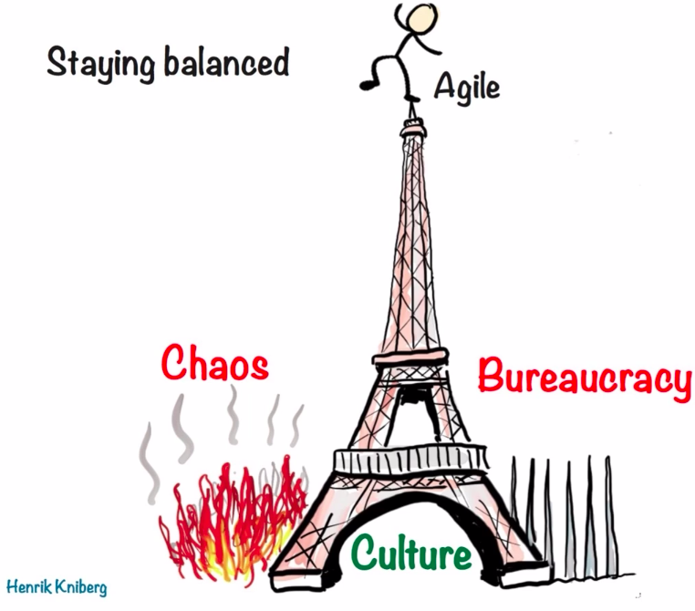
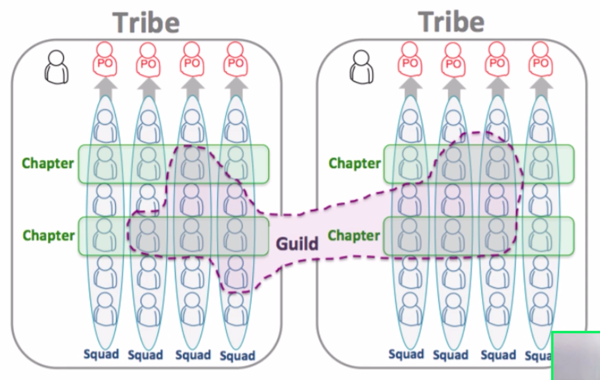
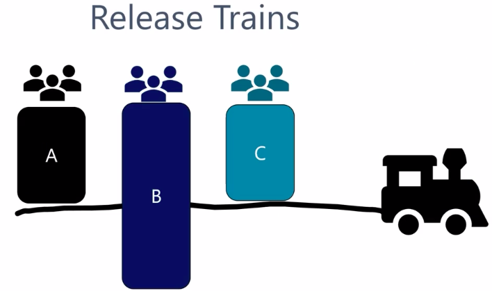
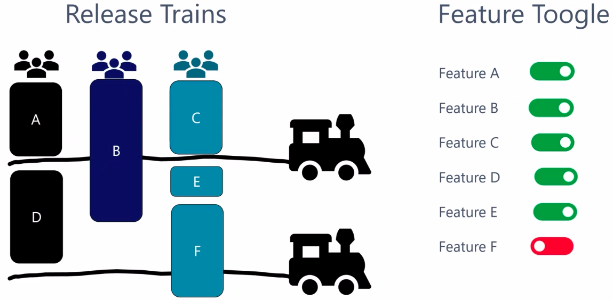

# Modelo Spotify
- É um modelo que vem realmente da empresa Spotify.
- Tem como objetivo encontrar um equilíbrio entre <b>caos</b> e <b>buracracia</b> que surgem quando têm-se equipes grandes.

- <b>O modelo Spotify pode ser dividido em:</b>
    - <b>Pessoas:</b>
        
        
        - Squads
            - É a mesma ideia de uma equipe Scrum.
            - É uma equipe auto gerenciável.
            - Possui todo conhecimento necessário para entregar valor.
            - São múltiplos Squads e cada um alinhado com o seu PO.
            - Os Squads tem a liberdade de inovar.
        - Tribos
            - São um conjunto de Squads que possuem algo em comum.
        - Capítulos
            - É uma forma de agrupar pessoas que possuem as mesmas competências dentro de uma tribo, para que uma possam compartilhar conhecimento e resoluções daquela tribo.
        - Líder do capítulo
            - É como um gerente de departamento, ele vai se preocupar com desenvolvimento pessoas, treinamento, salário.
        - Guild
            - Tem o mesmo objetivo dos capítulos, porém não é restrito a pessoas com as mesmas competências.
    - <b>Técnica:</b>
        - Arquitetura baseada em serviços: Dessa forma as Squads conseguem fazer realeases de partes específicas do sistema.
        - Especializaram as Squads em 3 tipos para facilitar as releases:
            - <b>Squads de Infraestrutura:</b> Cria ferramentas e processos que ajudam todas as Squads.
            - <b>Squads de Clientes:</b> Cria ferramentas e processos que facilitam a Squad de Features a fazerem realeases em todos os clientes. 
            - <b>Squads de Features:</b> Após implementar uma featura a Squad precisa fazer release em vários clientes diferentes, como Apple, Android, Windows, Linux, e ai entra a o apoio da Squad de Clientes.
        - As releases são alinhadas em uma dinâmica chamada <b>Release Train</b> onde as equipes alinham as features que cada Squad desenvolveu para uma realease semanal pré-agendada para determinado cliente (IOS, Android, etc).
        
        
        - Não necessariamente toda release vai ser apresentada ao usuário, a cada versão lançada eles podem ligar ou desligar uma featura de acordo com a necessidade <b>(Feature Toogle)</b>.
        
        
        - As releases são liberadas em pequenos grupos pois caso algo entre em produção e cause problemas eles tem chance de corrigir a tempo de atingir muitos clientes.
