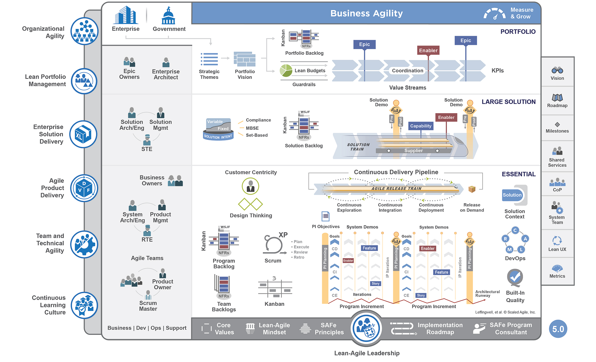

# Sacled Agile Framework (SAFe)
- É a principal solução utilizadas hoje por empresas para escalar agilidade.
- Enquanto o Scrum é voltado para equipe, o Kanban para processos o <b>SAFe é voltado para a empresa em geral</b>, ou seja, a agilidade do negócio como um todo.
- Quando uma empresa já é fundada em uma mentalidade ágil ela tem maior facilidade de encaixar o seu negócio no modelo SAFe.
- A organização inteira trabalha de forma ágil, com mentalidades enxutas e aprendendo continuamente.

