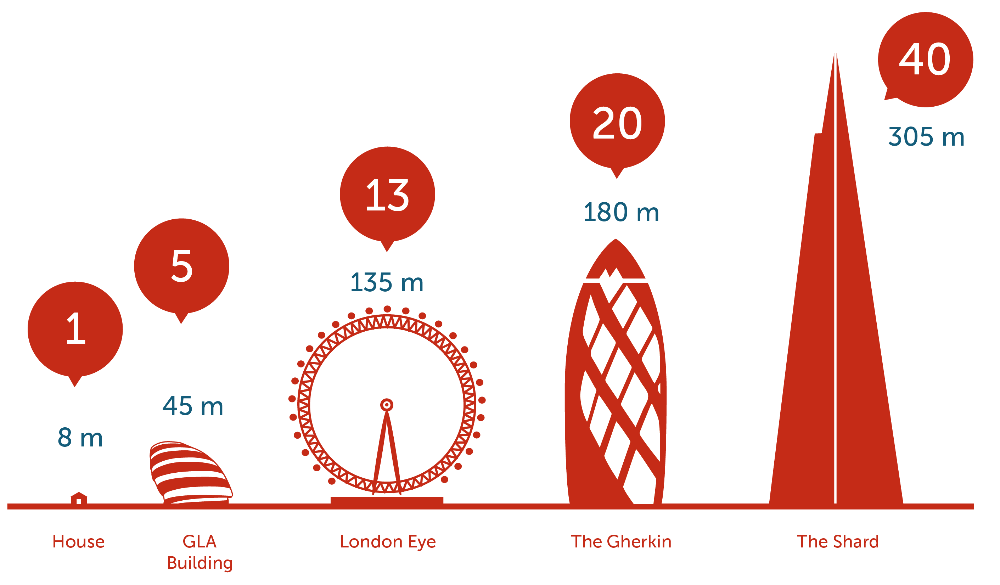

# Estimativas

- As estimativas estão relacionadas com estimar tamanho, esforço e até o custo de um item de Backlog.
- A estimativa ágil tem como premissas:
    - Um pouco de esforço ajuda muito.
    - Muito esforço ajuda pouco.

## Métricas de estimativa
### Story Point
- Trabalhamos com pontos e não horas.
- Pega o menor item de backlog, estima-se um valor <b>(que será o valor de 1 ponto)</b> e a partir dele é estimado os demais.

- Não se deve comparar velocidades de conclusão de Sprints entre equipes pois o ponto definido por cada equipe é diferente e é baseado no conhecimento da equipe como um todo.

### Planing Poker
- É um método de estimar o número de pontos.
- Como é feito?
    - Junta a equipe e pega um Product Backlog Item.
    - Da um baralho com os números disponíveis para que cada um da equipe escolha um valor que represente o número de pontos que ele acredita levar para realizar aquele item do Product Backlog.
    - Todos viram as cartas juntos e rapidamente entram em um acordo baseado em argumentos para chegar em um valor que todos concordem.