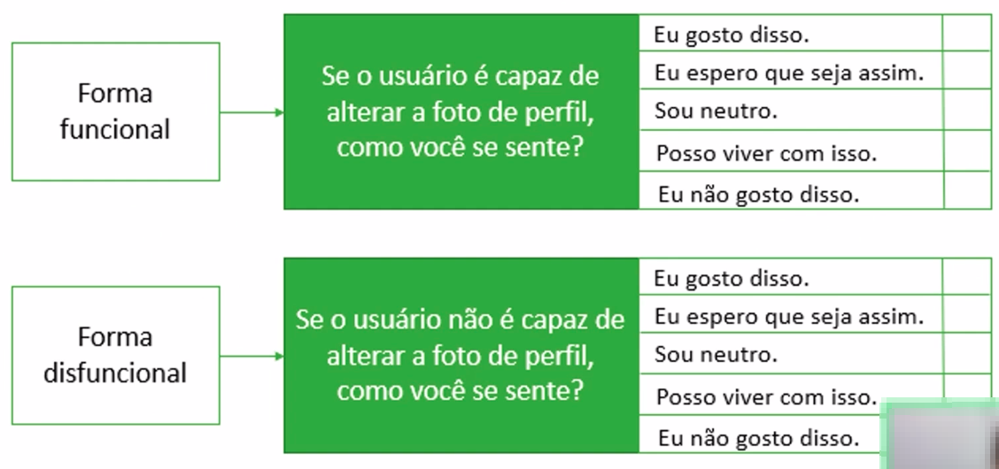
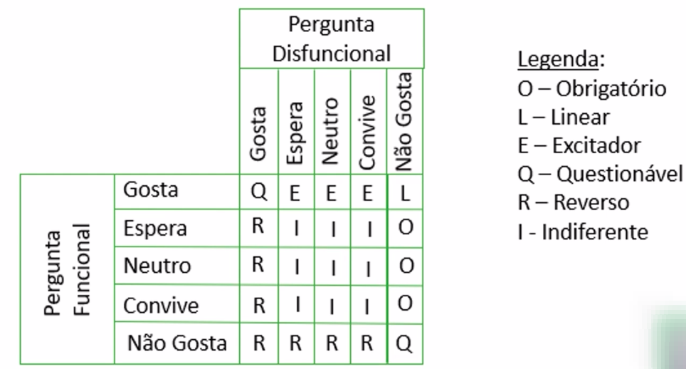

# Modelo Kano

- É uma técnica que tem como objetivo encontrar qual o <b>valor esperado para cada um dos items de Product Backlog</b>.
- O valor encontrado utilizando a técnica do modelo Kano é um valor em termos do quanto o cliente quer aquele item do Product Backlog, ou seja, é uma <b>priorização baseada no desejo</b>.
- Categorização de funcionalidades em três categorias:
    - Obrigatórios
        - É básico. Sua presença não agrega tanto valor mas sua ausência tem impacto negativo imenso.
    - Lineares
        - Quanto mais, melhor. Ou melhor, quanto mais funcionalidades lineares, mais o cliente pagará!
    - Excitadores ou alegradores
        - Necessidades desconhecidas.
- Como descobrir em qual categoria o Product Backlog Item analisado se encaixa (dos casos que não são tão óbvios)?
    - Seguindo a figura abaixo como exemplo, temos a forma funcional e disfuncional de perguntar o usuário.
    
    - Após coletas os dados seguindo o modelo acima, os dados são analisados nessa matriz como mostra o exemplo na figura abaixo.
    