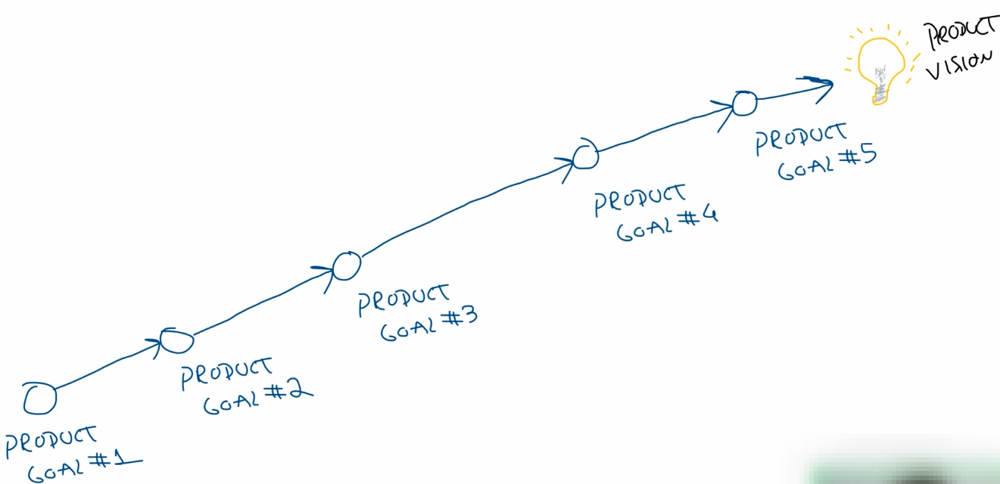

# Product Goal (Meta do produto)

- A partir da visão de um produto é decomposto em uma ou mais <b>metas de produto(Product Goal)</b> que é algo mais específico e mais curto prazo do que a visão.
- É a meta de um Product Backlog.
- O Product Goal faz parte da estratégia do produto.
- O Product Goal resumidamente são <b>manifestações da estratégia do produto</b>.
- Abaixo a imagem mostra o que seria o <b>Roadmap</b> do produto, que são as definições de todos Product Goals que levam até o Product Vision.

## Como definir um Product Goal
- 1º Parte da visão.
- 2º Analise da situação atual.
- 3º Product Goal:
    - Data (Ex: 6 meses)
    - Meta (Ex: Ter 100 usuarios, 3 paises e 1 compra cada)
    - Funcionalidades (Ex: cadastro, busca, lance, envio, que estarão descritas no Product Backlog)
    - Métricas (Ex: Contagem de usuários, países e de compras)