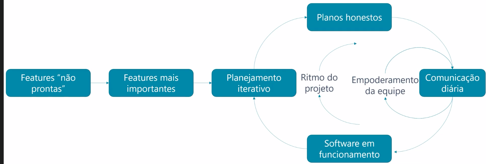
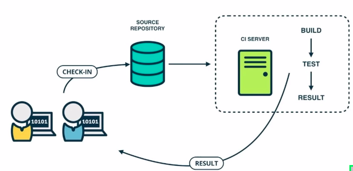
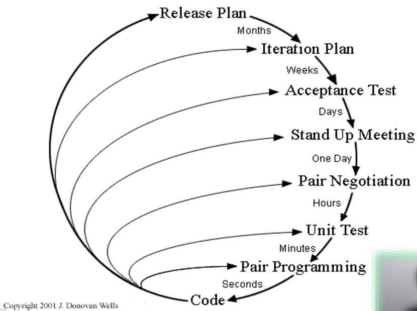
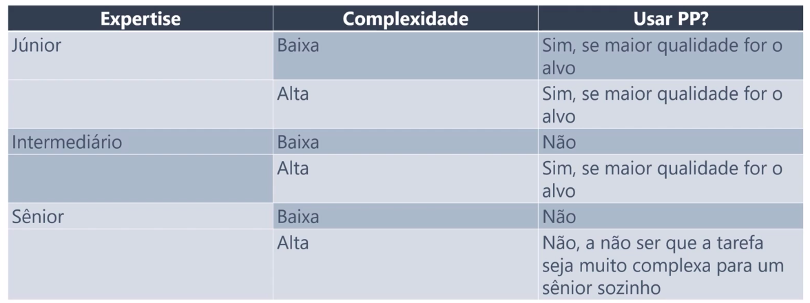

# Extreme Programing
- O XP é semelhante ao Scrum em alguns pontos, mas ele foi desenvolvido por programadores e então seu foco é mais no código em si.
- O processo do XP esta representado na figura abaixo.

## Práticas XP
- <b>Padrão de código:</b> Defina padrões de como se codifica de froma que mesmo que tenham muitas pessoas trabalhando no código você sempre ache que foi a mesma pessoa que fez (Formatação, Estrutura de código, Convenções de nomeclatura, Tratamento de erros e Comentários).
- <b>TDD</b>: Primeiro você desenolve e depois você desenvolve, refatora e repete o ciclo.
    - Ciclo do TDD:
        - 1º Escreve o teste
        - 2º Escreve o código
        - 3º Rodar o teste e verificar o resultado
        - 4º Refatorar
        - 5º Rodar o teste e verificar o resultado
        - 6º Corrigir o código
        - 7º Rodar o teste e verificar o resultado
    - Pontos positivos:
        - Melhoria da qualidade interna de código.
        - Melhoria da qualidade externa do código.
    - Pontos negativos:
        - Redução na produtividade.
    - Desafios para adoção prática:
        - Aumento no esforço.
        - Código legado.
        - Falta de habilidades para escrita dos testes.
        - Problemas específicos de domínio ou ferramenta.
- <b>Integração Contínua</b>:
    - A equipe sobe o código para um repositório e de forma automatizada o servidor busca essa mudança no repositório, roda o build, testes e mostra o resultado.
    
    - Vantagens:
        - Garantia e controle contínuo de qualidade.
        - Habilita releases rápidas e frequentes.
    - Desvantagens:
        - Escalabilidade.
        - Infraestrutura.
        - Habilidades específicas.
        - Domínios de aplicação.
- <b>"Cebola" do XP:</b> 
    
    - Release Plan:
        - Quais os objetivos deste lançamento?
        - Quais funcionalidades vamos entregas nesse lançamento?
        - Meses
        - Pode ser baseado em funcionalidades ou em data.
    - Interation Plan.
    - Acceptance Test.
    - Stand Up Meeting.
    - Pair Negotiation.
    - Unit Test.
    - Pair Programming: são duas pessoas na frente do computador programando juntas, enquanto uma escreve a outra vai validando.
        - Realidade da programação em pares:
            - Tarefa complexa:
                - Maior qualidade.
                - Maior esforço.
            - Tarefa simples:
                - Menor esforço.
                - Menor qualidade.
            - Par de júnior pode alcançar performance de um sênior.
            - Fatores que podem influenciar.
                - Aspectos sociais.
                - Tipo de tarefa.
        - Quando usar?
            
    - Code.
    
    
