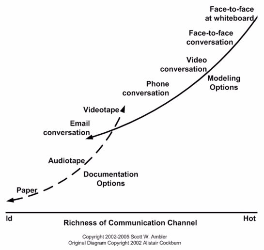
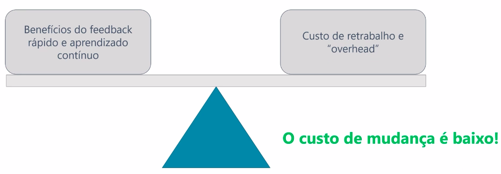

# Manifesto Ágil

## Manifesto para Desenvolvimento Ágil de Software
 "Estamos <b>descobrindo</b> maneiras <b>melhores</b> de desenvolver software, fazendo-o nós mesmos e ajudando outros a fazerem o mesmo. Através deste trabalho, passamos a valorizar:"
 ### 4 valores ágeis:
 - <b>Indivíduos e interações:</b> mais que processos e ferramentas.
 - <b>Software em funcionamento:</b> mais que documentação abrangente.
 - <b>Colaboração com o cliente:</b> mais que negociação de contratos.
 - <b>Responder a mudança:</b> mais que seguir um plano.

Ou seja, mesmo havendo valor nos itens à direita, valorizamos mais os itens à esquerda.

## Mentalidade Ágil
- Enxergar erros como oportunidades de aprendizagem.
- Adotar ciclos curtos, colaboração e mudança.
- Focar na entrega de valor.

## 12 princípios da agilidade

### Podem ser classificados em 4 tipos:
- <b>Projeto:</b> Esforço temporário para entregar algo único. É só uma forma que a empresa tem de organizar uma entrega.
    - <b>Satisfação:</b> Satisfação ao cliente com o software em funcionamento. A equipe não sabe se ela está indo no caminho certo sem entregar algo para que o cliente possa ver, usar e avaliar.
    - <b>Mudanças são sempre bem vindas:</b> A preocupação maior é sempre com a satisfação do cliente e do problema, portanto, mudanças são sempre bem vindas.
    - <b>Entregar sempre em ciclos curtos:</b> Sempre entregar valor aos poucos e em períodos curtos.
    - <b>Ritmo sustentável:</b> Um ritmo sustentável é necessário pois deve ser capaz de ser mantido por um período longo de tempo obtendo uma consistência nas entregas.
    - <b>Progresso em função do software em funcionamento:</b> A entrega do produto sempre precisa ser algo utilizável ou seja, que agregue valor. 
- <b>Produto:</b>
    - <b>Simplicidade:</b> Aplique o KISS(Keep It Simple Stupid) pois 20% das funcionalidades do software entregam 80% do valor.
    - <b>Simplicidade:</b> Aplique o <b>KISS(Keep It Simple Stupid)</b> pois 20% das funcionalidades do software entregam 80% do valor.
    - <b>Excelência Técnica:</b> Faça a melhor solução para o problema que você tem.
- <b>Pessoas:</b>
    - <b>Comunicação face a face:</b> Priorize a conversação ao vivo pois é muito mais eficiente.
    
    - <b>Cliente como integrante da equipe:</b> Quem está com o problema trabalha com quem está tentando resolver de forma colaborativa.
    - <b>Equipes auto-organizavéis:</b> A equipe junta deve trabalhar e definir uma solução.
    - <b>Confiança e apoio:</b> Você precisa fazer o projeto com pessoas motivadas. A motivação é chave para a produtividade.
- <b>Processo:</b>
    - <b>Refletir e ajustar:</b> Além de preocupados em aprender sobre o produto devemos estar preocupados também com qual é a melhor forma de resolver o produto. Portando em perídos curtos a equipe tem que avaliar se ela está indo bem, se ela deve melhorar algum processo ou ferramenta, a forma de comunicação, etc.

## A aposta da mentalidade ágil é:
Os benefícios do feedback rápido e aprendizado contínuo trazidos pela mentalidade ágil vão sobrepor os custos de retrabalho e overhead.

