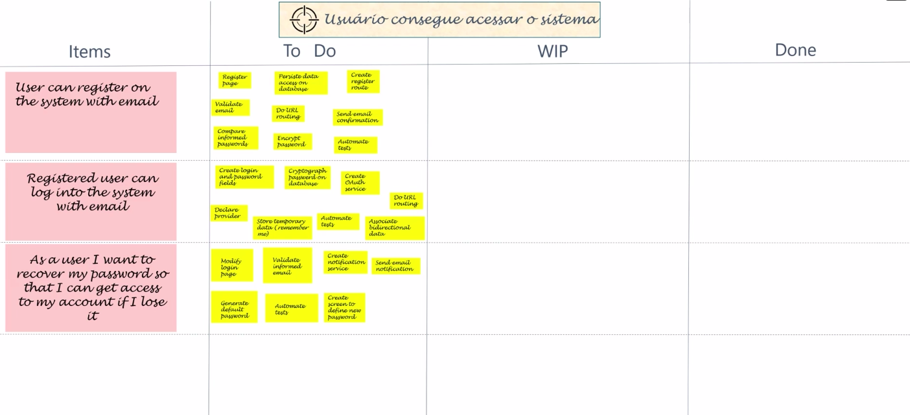
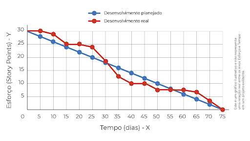

# Sprint Execution
- Criar os <b>entregáveis</b>
    - De forma resumida, no Sprint Execution vai ser transformar as tarefas que estão no Sprint Backlog em incrementos.
    - Para auxiliar a equipe no dia a dia geralmente é utilizado um <b>Scrum Board</b>(representado na figura abaixo) que durante a Sprint a equipe vai atualizando.
    
- Realizar as <b>Daily Scrums</b>
    - Uma pequena reunião realizada todos os dias que tem como objetivo ajudar a equipe com a sincronização de atividades.
    - Geralmente todos ficam em pé nessa reunião.
    - É abordado se alguém está com algum problema.
    - É discutido se vai ou não alcançar a meta da Sprint.
    - Quem participa dessa reunião são os desenvolvedores.
    - Deve durar no máximo 15 minutos.
    - <b>Todos integrantes devem responder essas 3 perguntas:</b>
        - 1ª O que eu fiz desded a última reunião?
        - 2ª O que eu farei até a próxima reunião?
        - 3ª Eu tive ou tenho algum impedimento?
- Durante a Sprint a equipe pode usar uma ferramenta para <b>acompanhar seu progresso</b> como o gráfico <b>Burndown</b> abaixo:

- Refinar o Product Backlog (Backlog Refinement)
    - Podem ser feito sessões, como por exemplo pegar 1 hora com os desenvolvedores, PO e algum convidado que conheça bem alguma tecnologia para todos juntos quebrar mais alguns items de Backlog em items mais precisos.

## Quebrando alguns MITOS sobre o Scrum
- 1º Você <b>não</b> precisa lançar ao final de cada Sprint.
- 2º A Sprint <b>não é um gate.</b> Um lançamento pode ser realizado durante a Sprint.

## Perguntas para pensar
- A Sprint está terminando e nem todas as tarefas foram finalizadas. A equipe quer jogar algumas para a próxima sprint. O que fazer?
    - R: Não pode fazer isso. O correto é voltar o que faltou para o Product Backlog e realizar uma nova Sprint Planning.
- Surgiu um bug crítico em Produção. Estamos na metade da Sprint. Temos que esperar para a próxima Sprint para corrigi-lo?
    - R: Não. Se o bug puder ser jogado dentro das tarefas do PBI sem afetar o Sprint Goal. Pode colocar a tarefas de resolver o bug em algum lugar de outra tarefa que não é extremamente importante para o Sprint Goal. Em ultimo caso se a correção desse bug for influenciar diretamente a meta, pode matar a Sprint e planejar outra.

    