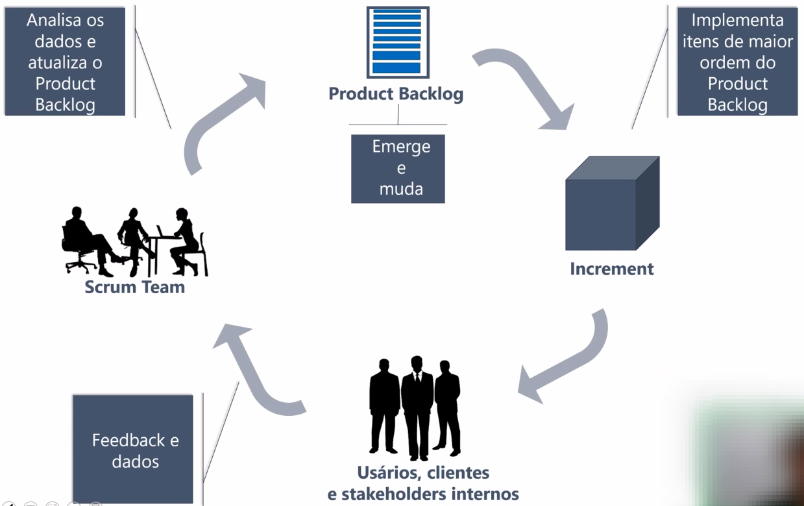
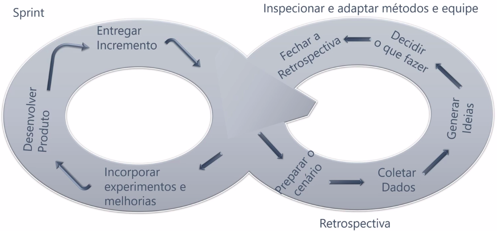
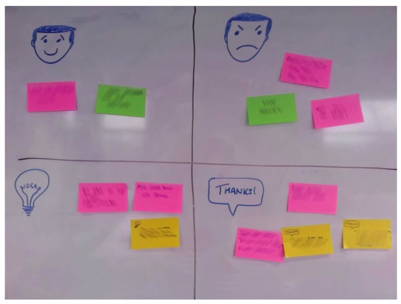
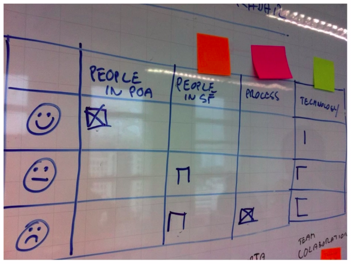

# Sprint Review vs Sprint Retrospective

## Sprint Review
- É o último estágio da Sprint.
- É geralmente uma reunião que vai durar no máximo 4 horas.
- O objetivo é inspecionar e avaliar os resultados da equipe durante a Sprint e adaptar e definir os próximos passos, que geralmente significa adaptar o Product Backlog ou até mesmo mudar o Product Goal.
- Os usuários, clientes e stakeholders internos são os que avaliam o <b>incremento</b> entregue e dão feedbacks (Não necessariamente todos eles, somente aqueles que de fato possuem algo para contribuir).
- A partir dos feedbacks e dados recebidos eles devem ser analisados pela equipe Scrum e posteriormente deve-se atualizar o Product Backlog.
- O objetivo da Sprint Review é diminuir a distância entre o cliente real e a Equipe Scrum.
- Abaixo temos uma imagem que representa todo esse fluxo.

## Sprint Retrospective
- É realizada depois da Sprint Review.
- Geralmente tem duração de no máximo 3 horas.
- É onde a equipe Scrum vai inspecionar e adaptar a forma como ela está trabalhando.
- Uma forma de organizar a Sprint Retrospective é apresentada na imagem abaixo: 
- <b>Etapas da Sprint Retrospective:</b>
    - <b>Preparar o cenário:</b>

        - Dar as boas-vindas para equipe completa e reiterar a importância da reunião.
        - Dica:
            - Faça todos falarem durante o início da reunião.
            - "O que você espera dessa reunião"
                - Resposta de no máximo uma sentença...
        - Apresentar a estrutura da reunião.

    - <b>Coletar dados:</b>
        - Revise os dados disponíveis: Esses dados são como gráficos de Burnup, bugs que surgiram durante a Sprint.
        - Happy, Sad, Ideas, Thanks: É uma técnica onde cada integrante da equipe escreve o que o deixou feliz, triste, quais ideias teve e o que ele agradece durante tudo que aconteceu na Sprint.
        
        - Happiness radar: Pré-defina tópicos no início da reunião com a equipe e coloque em colunas, e peça para que cada pessoa responsa se está feliz, neutra ou triste com determinado tópico.
        
        - Ao final da coleta de dados a equipe deve reunir o que foi bem, o que não foi bem e a pode melhorar.
    - <b>Gerar Ideias:</b>

        - Baseado na lista do que foi levantando sobre <b> o que a equipe Scrum pode melhorar</b> chega a etapa de gerar ideias de como alcançar essas melhoras.
        - Algumas técnicas para ajudar nessa etapa são:
            - "Por que isso aconteceu?"
            - "Como podemos melhorar?"
            - Diagrama de causa-efeito
            - 5W
            - Riscos
    - <b>Decidir o que vai ser feito:</b>

        - É importante a presença do PO aqui principalmente para esse tópico.
        - Tratar itens de melhoria como itens de backlog.
            - Retrospective Planning Game, Planning Poker.
            - Dot voting.
        - No final dessa etapa a equipe teŕa um plano de melhoria que pode ter algumas coisas a serem refinadas no Product Backlog também ou não.
    - <b>Fechar a retrospectiva:</b>
    
        - Agradeceer a equipe pelo trabalho duro.
        - Coletar feedback sobre a dinâmica da Sprint Restrospective.
        - Tente não repetir muito a dinâmica para não ficar algo entediante.
