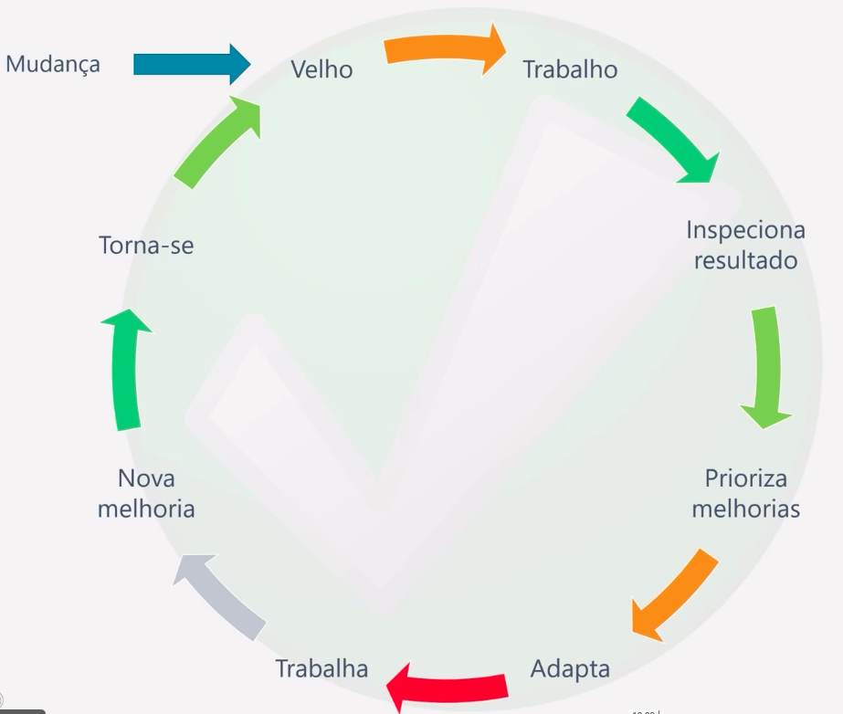
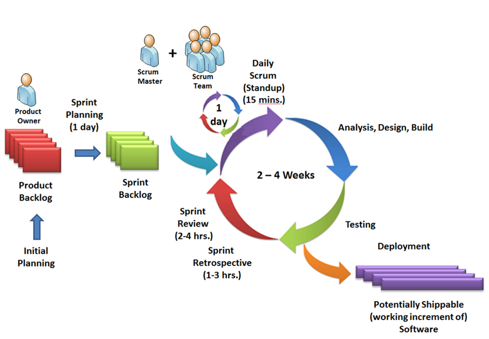

# SCRUM

- O SCRUM é um <b>mecanismo(estrutura básica)</b> para <b>otimizar</b> o sistema de entrega de <b>valor</b> em ambientes <b>complexos</b>. 
- O SCRUM te ajuda a saber o <b>mínimo</b> de como implementar os 3 V's da mentalidade ágil na prática.

## Estrutura do SCRUM
